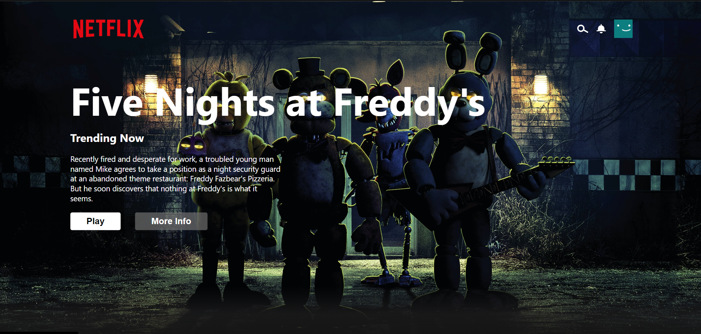

# Netflix UI Clone
This project is a Netflix UI clone created using React.js. It mimics the user interface of the Netflix website.

### Features
Displays movie and TV show data similar to Netflix.
Allows users to browse through a collection of movies and TV shows.
Provides a search functionality to find specific movies or TV shows.

### Technologies Used
React.js
HTML/CSS
JavaScript
Api

### Demo
Check out the live demo.
[Netflix Clone UI Design Link](https://netflix-clone-ui-design.netlify.app/)

### Getting Started
To run this project locally:
Clone this repository.
Install dependencies using npm install.
Start the development server using npm start.

### Contributing
Contributions are welcome! If you find any issues or have suggestions for improvements, feel free to create a pull request.